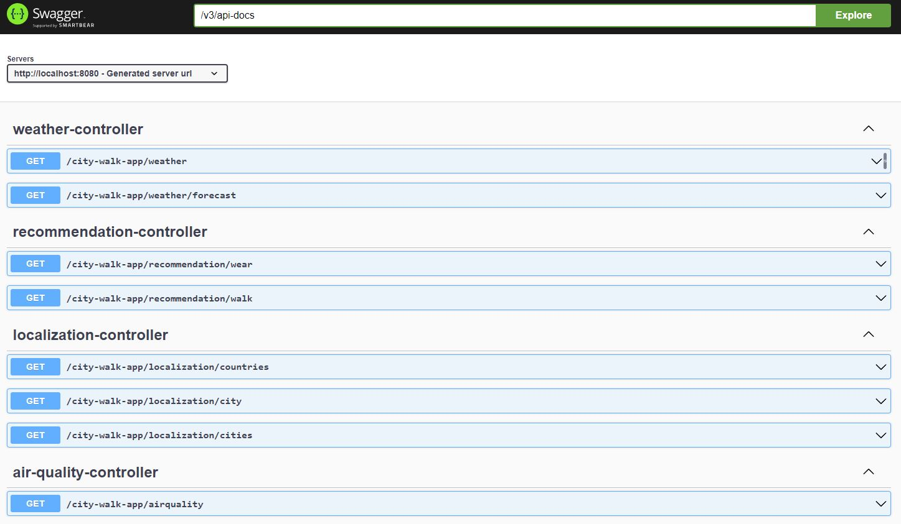
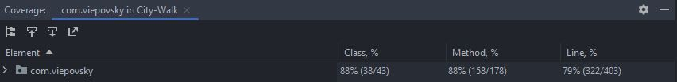

# City Walk App

[](https://github.com/viepovsky/City-Walk-App/actions/workflows/maven.yml)
[](https://codecov.io/gh/viepovsky/City-Walk-App)
[](https://hub.docker.com/r/viepovsky/city-walk/tags)

The application provides users with personalized recommendations for outdoor activities and clothing based on the current weather and air quality conditions of a given location. 
By inputting the coordinates of their city, users can receive recommendations on what to wear and whether it's a good day to go outside. The app also stores the coordinates of cities for easy access.

## Technologies

The application currently uses the following frameworks and technologies:

- Spring Boot: Web, Data JPA, Test, Validation
- Unit tests with: JUnit, Mockito
- Docker
- Lombok
- Maven

## External APIs

At the moment, the City Walk App uses two external APIs:

- Air Quality API to retrieve air quality for a given location.
- Weather API to retrieve the current weather and a 13-day forecast for the given location.

## How to run

To start the application, clone this repository and run the `CityWalkApplication` class or type `./mvnw spring-boot:run` in your IDE terminal.

Alternatively, if you have Docker installed, you can run the application in a container using the following command in your terminal or cmd:

```
docker run -d -p 8080:8080 viepovsky/city-walk
```

## Endpoints

The app provides many endpoints, but users can start by retrieving coordinates for a specific city:
- `http://localhost:8080/city-walk-app/localization/city?country-code=PL&city=Kalisz` -  retrieves coordinates for a given country code and city in JSON format like this:
```json
{
    "countryCode": "PL",
    "name": "Poznań",
    "latitude": "52.40692",
    "longitude": "16.92993"
}
```
Afterward, users can check the current weather for that location:
- `http://localhost:8080/city-walk-app/weather?latitude=52.40692&longitude=16.92993` - retrieves the current weather for the given coordinates in JSON format like this:
```json
{
    "symbol": "n400",
    "symbolPhrase": "overcast",
    "temperature": 14,
    "feelsLikeTemp": 14,
    "dewPoint": 8,
    "windSpeed": 9,
    "uvIndex": 0,
    "pressure": 1013.29,
    "visibility": 10000
}
```
The main function of the app is to provide recommendations, including walk recommendations:
- `http://localhost:8080/city-walk-app/walk?latitude=52.40692&longitude=16.92993` -  retrieves walk recommendations for the current air quality and UV index for the given coordinates in JSON format like this:
```json
{
    "recommendation": "RECOMMENDED",
    "aqiScale": "GOOD",
    "uvIndexScale": "LOW"
}
```
and wear recommendations:
- `http://localhost:8080/city-walk-app/wear?date=YYYY-MM-DD&latitude=52.40692&longitude=16.92993` -  retrieves wear recommendations for the current weather for the given date and coordinates in JSON format like this:
```json
{
    "weatherDesc": "COOL",
    "head": "NONE",
    "upperBody": "SHIRT",
    "lowerBody": "JEANS",
    "foot": "SNEAKERS",
    "rain": "NO"
}
```
## Example usage - frontend

Here is a simple example of how to use the application to get wear and walk information. 
The page is hosted on GitHub Pages, and you can access it here: [viepovsky.github.io](https://viepovsky.github.io)

Please note that the application is hosted on the free version of Replit, so it may be asleep until it receives a request. 
The initial call to the API may take some time.

Please also keep in mind that the application's appearance is basic, but it is fully functional.

## Swagger endpoints view



## Test coverage


